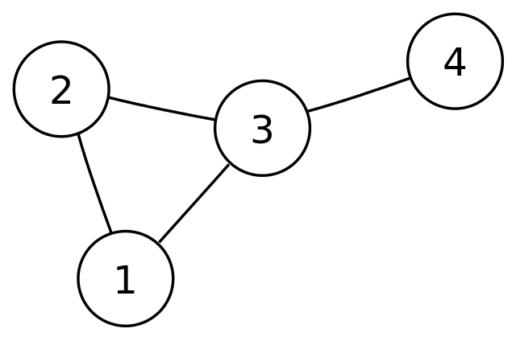

# Graph Algorithms

Graph algorithms are fundamental in computer science and are used to solve various problems related to graphs, which are collections of nodes (vertices) and edges (connections between nodes).

## Characteristics

- **Nodes (Vertices)**: Represent entities or objects.
- **Edges**: Represent relationships between nodes.
- **Directed Graphs**: Edges have a direction.
- **Undirected Graphs**: Edges have no direction.
- **Weighted Graphs**: Edges have weights or costs associated with them.
- **Cycle**: A path that starts and ends at the same node.
- **Path**: A sequence of nodes connected by edges.

## Types of Graph Algorithms

- **Traversal Algorithms**: Algorithms for visiting all the nodes of a graph.
  - Depth-First Search (DFS)
  - Breadth-First Search (BFS)
- **Shortest Path Algorithms**: Algorithms for finding the shortest path between two nodes.
  - Dijkstra's Algorithm
  - Bellman-Ford Algorithm
  - Floyd-Warshall Algorithm
- **Minimum Spanning Tree Algorithms**: Algorithms for finding a subset of edges that connect all the vertices in a graph with minimum total edge cost.
  - Prim's Algorithm
  - Kruskal's Algorithm
- **Topological Sorting**: Arranging the nodes in a directed acyclic graph (DAG) in a linear order respecting the edges’ directions.

## Applications

Graph algorithms have a wide range of applications, including:

- **Social Networks**: Analyzing connections between users.
- **Transportation Networks**: Finding the shortest route between two locations.
- **Recommendation Systems**: Identifying similarities between users or products.
- **Network Routing**: Routing packets in computer networks.
- **Data Mining**: Discovering patterns and relationships in large datasets.
- **Genetics**: Modeling genetic interactions and pathways.

## JavaScript Examples

- [Graph Algorithms in JavaScript](https://www.freecodecamp.org/news/data-structures-in-javascript-with-examples/#graphs): A comprehensive guide to implementing graph algorithms in JavaScript, including traversal, shortest path, and minimum spanning tree algorithms.

For more information on graph algorithms in JavaScript, visit the [Graph Algorithms in JavaScript](https://www.freecodecamp.org/news/data-structures-in-javascript-with-examples/#graphs) guide.
