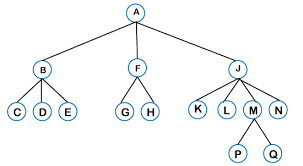

# Tree Data Structure

A tree is a widely used hierarchical data structure in computer science. It consists of nodes connected by edges. Each node has a value and may have a number of children nodes.

## Characteristics

- **Nodes**: Each element in a tree is called a node. Nodes are the fundamental building blocks of trees.
- **Root**: The topmost node in a tree is called the root. It is the starting point for traversing the tree.
- **Edges**: The connections between nodes are called edges. Edges represent relationships between nodes.
- **Parent**: A node is a parent if it has children nodes connected to it.
- **Child**: A node is a child if it is connected to a parent node.
- **Leaf**: A node with no children is called a leaf.
- **Height**: The height of a tree is the length of the longest path from the root to a leaf.
- **Depth**: The depth of a node is the length of the path from the root to that node.

## Types of Trees

- **Binary Tree**: A tree in which each node can have at most two children nodes.
- **Binary Search Tree (BST)**: A binary tree in which the left child node has a value less than its parent node, and the right child node has a value greater than its parent node.
- **Balanced Tree**: A tree in which the height of the left and right subtrees of any node differ by at most one.
- **AVL Tree**: A self-balancing binary search tree where the difference in heights of the left and right subtrees is at most one for every node.
- **Red-Black Tree**: A balanced binary search tree with additional properties that ensure balance during insertion and deletion operations.
- **B-tree**: A tree data structure that maintains sorted data and allows searches, sequential access, insertions, and deletions in logarithmic time.

## Applications

Trees are used in various applications, including:

- Representing hierarchical data such as file systems, organization charts, and XML/HTML documents.
- Implementing data structures like binary search trees for efficient searching, insertion, and deletion operations.
- Parsing expressions and evaluating arithmetic expressions.
- Optimizing searching algorithms, such as binary search, in databases and indexing.
- Implementing dynamic programming algorithms like memoization for solving problems efficiently.

## JavaScript Examples

- [Data Structures in JavaScript with Examples](https://www.freecodecamp.org/news/data-structures-in-javascript-with-examples/#trees): A comprehensive guide to implementing tree data structures in JavaScript, including binary trees, binary search trees, and traversal algorithms.

For more information on trees in JavaScript, visit the [Data Structures in JavaScript with Examples](https://www.freecodecamp.org/news/data-structures-in-javascript-with-examples/#trees) guide.
